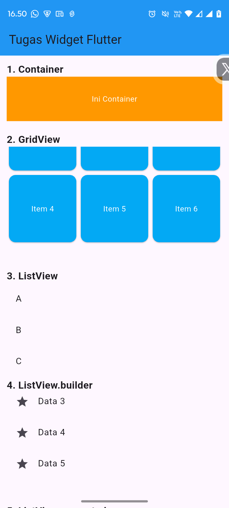
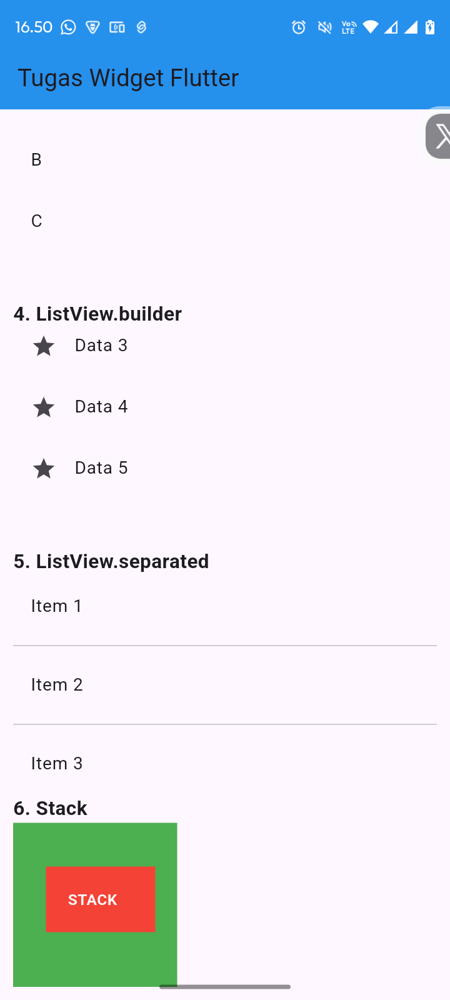

<div align="center">
  <br />

  
  <h1>LAPORAN PRAKTIKUM <br>
  APLIKASI BERBASIS PLATFORM
  </h1>

  <br />

  <h3>MODUL - 4 & 5<br>
    Antar Muka Pengguna
  </h3>

  <br />

  

  <br />
  <br />
  <br />

  <h3>Disusun Oleh :</h3>

  <p>
    <strong>Iqbal Bawani</strong><br>
    <strong>2311102130</strong><br>
    <strong>S1 IF-11-04</strong>
  </p>

  <br />

  <h3>Dosen Pengampu :</h3>

  <p>
    <strong>Cahyo Prihantoro, S.Kom., M.Eng.</strong>
  </p>
  
  <br />

  <h3>LABORATORIUM HIGH PERFORMANCE
  <br>FAKULTAS INFORMATIKA <br>UNIVERSITAS TELKOM PURWOKERTO <br>2026</h3>
</div>

<hr>

---

# 1. Tugas
📝 Tugas Praktikum Modul 4-5 Flutter

Buat 1 project Flutter yang menampilkan beberapa widget UI berikut:  
🔹 Yang harus ada:  
Container → kotak berwarna  
GridView → minimal 6 item (grid)  
ListView → 3 item (A, B, C)  
ListView.builder → list dari data array  
ListView.separated → list + garis pembatas  
Stack → tampilan bertumpuk (kotak / text)  

📦 Output yang dikumpulkan:
Screenshot hasilnya
Source code
Penjelasan singkat tiap widget

---

# 2. Source Code main.dart
```dart
import 'package:flutter/material.dart';

void main() {
  runApp(const MyApp());
}

class MyApp extends StatelessWidget {
  const MyApp({super.key});

  @override
  Widget build(BuildContext context) {
    return MaterialApp(
      debugShowCheckedModeBanner: false,
      title: 'Tugas Widget Flutter Iqbal Bawani',
      home: const HomePage(),
    );
  }
}

class HomePage extends StatelessWidget {
  const HomePage({super.key});

  final List<String> data = const [
    "Data 1",
    "Data 2",
    "Data 3",
    "Data 4",
    "Data 5",
  ];

  @override
  Widget build(BuildContext context) {
    return Scaffold(
      appBar: AppBar(
        title: const Text("Tugas Widget Flutter"),
        backgroundColor: Colors.blue,
      ),
      body: SingleChildScrollView(
        child: Padding(
          padding: const EdgeInsets.all(12),
          child: Column(
            crossAxisAlignment: CrossAxisAlignment.start,
            children: [
              const Text(
                "1. Container",
                style: TextStyle(fontSize: 18, fontWeight: FontWeight.bold),
              ),
              Container(
                width: double.infinity,
                height: 80,
                alignment: Alignment.center,
                color: Colors.orange,
                child: const Text(
                  "Ini Container",
                  style: TextStyle(color: Colors.white),
                ),
              ),

              const SizedBox(height: 20),

              const Text(
                "2. GridView",
                style: TextStyle(fontSize: 18, fontWeight: FontWeight.bold),
              ),
              SizedBox(
                height: 200,
                child: GridView.count(
                  crossAxisCount: 3,
                  children: List.generate(
                    6,
                    (index) => Card(
                      color: Colors.lightBlue,
                      child: Center(
                        child: Text(
                          "Item ${index + 1}",
                          style: const TextStyle(color: Colors.white),
                        ),
                      ),
                    ),
                  ),
                ),
              ),

              const SizedBox(height: 20),

              const Text(
                "3. ListView",
                style: TextStyle(fontSize: 18, fontWeight: FontWeight.bold),
              ),
              SizedBox(
                height: 150,
                child: ListView(
                  children: const [
                    ListTile(title: Text("A")),
                    ListTile(title: Text("B")),
                    ListTile(title: Text("C")),
                  ],
                ),
              ),

              const SizedBox(height: 20),

              const Text(
                "4. ListView.builder",
                style: TextStyle(fontSize: 18, fontWeight: FontWeight.bold),
              ),
              SizedBox(
                height: 180,
                child: ListView.builder(
                  itemCount: data.length,
                  itemBuilder: (context, index) {
                    return ListTile(
                      leading: const Icon(Icons.star),
                      title: Text(data[index]),
                    );
                  },
                ),
              ),

              const SizedBox(height: 20),

              const Text(
                "5. ListView.separated",
                style: TextStyle(fontSize: 18, fontWeight: FontWeight.bold),
              ),
              SizedBox(
                height: 180,
                child: ListView.separated(
                  itemCount: data.length,
                  separatorBuilder: (context, index) =>
                      const Divider(thickness: 1),
                  itemBuilder: (context, index) {
                    return ListTile(title: Text("Item ${index + 1}"));
                  },
                ),
              ),

              const SizedBox(height: 20),

              // STACK
              const Text(
                "6. Stack",
                style: TextStyle(fontSize: 18, fontWeight: FontWeight.bold),
              ),
              SizedBox(
                height: 150,
                child: Stack(
                  children: [
                    Container(width: 150, height: 150, color: Colors.green),
                    Positioned(
                      top: 40,
                      left: 30,
                      child: Container(
                        width: 100,
                        height: 60,
                        color: Colors.red,
                      ),
                    ),
                    const Positioned(
                      top: 60,
                      left: 50,
                      child: Text(
                        "STACK",
                        style: TextStyle(
                          color: Colors.white,
                          fontWeight: FontWeight.bold,
                        ),
                      ),
                    ),
                  ],
                ),
              ),
            ],
          ),
        ),
      ),
    );
  }
}

```
# 3. Penjelasan Code
Program dibuat menggunakan framework Flutter dengan bahasa pemrograman Dart. Struktur aplikasi diawali dengan fungsi `main()` yang menjalankan widget `MyApp` menggunakan `runApp()`. Widget `MyApp` berfungsi sebagai root widget yang membungkus seluruh aplikasi menggunakan `MaterialApp`, sedangkan `HomePage` menjadi halaman utama yang ditampilkan. Pada halaman utama digunakan widget `Scaffold` sebagai kerangka dasar aplikasi yang terdiri dari `AppBar` dan `Body`. Seluruh komponen UI ditempatkan di dalam `SingleChildScrollView` dan `Column` sehingga dapat ditampilkan secara vertikal dan tetap dapat di-scroll ketika ukuran konten melebihi tinggi layar perangkat.

Di dalam body terdapat beberapa widget yang menjadi objek praktikum, yaitu `Container`, `GridView`, `ListView`, `ListView.builder`, `ListView.separated`, dan `Stack`. Widget `Container` digunakan untuk menampilkan kotak berwarna, `GridView` digunakan untuk menampilkan enam item dalam bentuk grid, sedangkan `ListView` menampilkan tiga data statis berupa A, B, dan C. Selanjutnya, `ListView.builder` dan `ListView.separated` memanfaatkan array data untuk menghasilkan daftar item secara dinamis, dengan `ListView.separated` menambahkan garis pemisah antar item menggunakan widget `Divider`. Terakhir, widget `Stack` digunakan untuk menampilkan beberapa widget secara bertumpuk sehingga menghasilkan tampilan berlapis antara kotak dan teks..

# 4. Screen Shoot hasil running dan pejelasan Widget
## 1. Container

<p align="center">
  
</p>
Deskripsi: 
Container merupakan widget dasar Flutter yang digunakan untuk membuat area berbentuk kotak. Pada program ini Container memiliki warna oranye, tinggi 80 pixel, dan lebar mengikuti ukuran layar. Teks "Ini Container" ditempatkan di tengah menggunakan properti alignment: Alignment.center.*

Fungsi utama Container adalah sebagai pembungkus widget lain yang dapat diberikan warna, ukuran, margin, padding, maupun dekorasi tambahan.
## 2. GridView

<p align="center">
  
</p>
Deskripsi: GridView digunakan untuk menampilkan data dalam bentuk grid atau susunan baris dan kolom. Pada program ini digunakan GridView.count dengan nilai crossAxisCount: 3, sehingga menghasilkan tiga kolom dan enam item.

Setiap item ditampilkan menggunakan widget Card yang berisi teks "Item 1" hingga "Item 6". GridView sangat cocok digunakan untuk menampilkan menu aplikasi, katalog produk, maupun galeri gambar. 
## 3. ListView

<p align="center">
  
</p>
Deskripsi: ListView merupakan widget yang digunakan untuk menampilkan daftar item secara vertikal. Pada implementasi ini terdapat tiga item statis yaitu A, B, dan C yang ditampilkan menggunakan widget ListTile.

ListView cocok digunakan untuk menampilkan data yang jumlahnya sedikit dan tidak memerlukan proses pembuatan item secara dinamis.

## 4. ListView.builder 

<p align="center">
  
</p>
Deskripsi: ListView.builder digunakan untuk membuat daftar item secara dinamis berdasarkan sumber data tertentu. Pada program ini data diambil dari array yang berisi lima elemen.

Widget ini lebih efisien dibandingkan ListView biasa karena item hanya akan dibuat ketika diperlukan saat proses scrolling. Setiap item ditampilkan menggunakan ListTile yang dilengkapi ikon bintang pada bagian kiri.

## 5. ListView.separated

<p align="center">
  
</p>
Deskripsi: ListView.separated digunakan untuk menampilkan daftar item yang dipisahkan oleh widget separator. Pada program ini separator yang digunakan adalah widget Divider sehingga setiap item memiliki garis pembatas.

Penggunaan separator membuat tampilan daftar menjadi lebih rapi dan memudahkan pengguna dalam membedakan setiap item yang ditampilkan.

## 6. Stack

<p align="center">
  
</p>
Deskripsi: Stack merupakan widget yang memungkinkan beberapa widget ditampilkan secara bertumpuk (overlay). Pada implementasi ini terdapat Container berwarna hijau sebagai lapisan dasar, Container merah yang diposisikan menggunakan widget Positioned, dan teks "STACK" yang berada di atas kedua Container tersebut.

Widget Stack sering digunakan untuk membuat badge notifikasi, overlay gambar, efek layer, maupun tampilan antarmuka yang memerlukan beberapa lapisan widget.


##### KESIMPULAN 
Berdasarkan hasil praktikum yang telah dilakukan, seluruh widget yang diminta pada tugas berhasil diimplementasikan dengan baik menggunakan Flutter. Widget Container digunakan untuk membuat area tampilan berbentuk kotak, GridView digunakan untuk menampilkan data dalam bentuk grid, ListView digunakan untuk menampilkan daftar item secara vertikal, ListView.builder digunakan untuk menampilkan data secara dinamis dari array, ListView.separated digunakan untuk menambahkan garis pembatas antar item, dan Stack digunakan untuk menampilkan widget secara bertumpuk.

Melalui praktikum ini dapat dipahami bahwa Flutter menyediakan berbagai widget yang memudahkan pengembangan antarmuka pengguna secara fleksibel, terstruktur, dan efisien. Pemahaman terhadap widget dasar tersebut menjadi fondasi penting dalam proses pengembangan aplikasi berbasis platform menggunakan Flutter.
