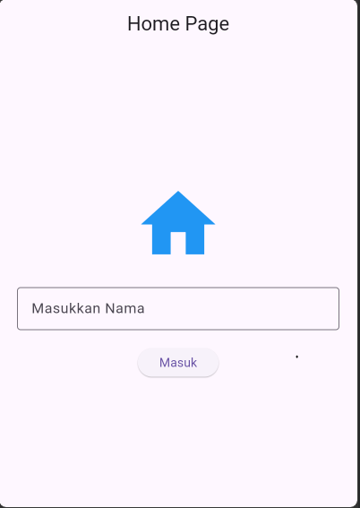
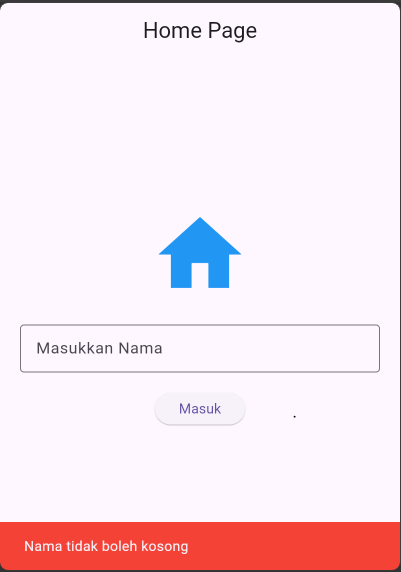
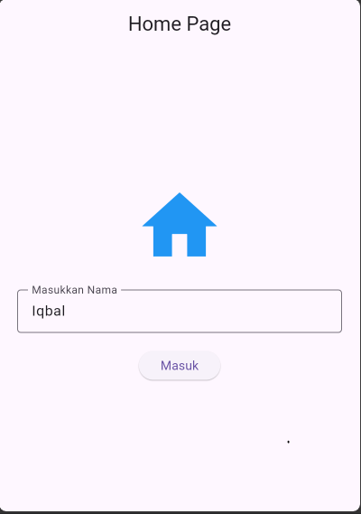
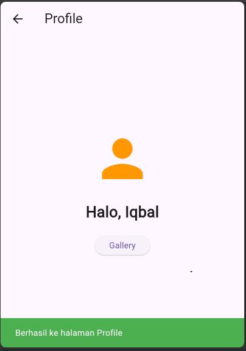
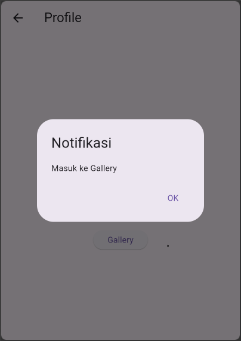
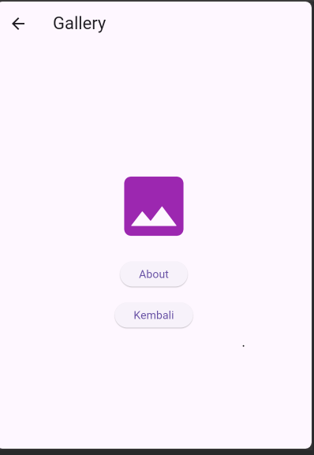
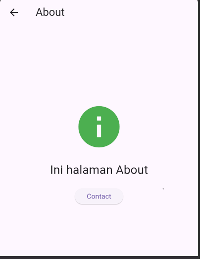
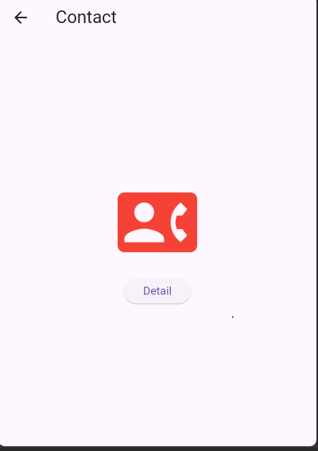
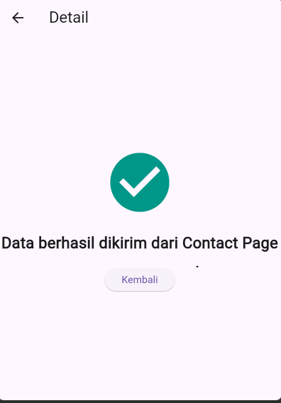

<div align="center">

# LAPORAN PRAKTIKUM
# PEMROGRAMAN PERANGKAT BERGERAK

### MODUL 7
### Praktikum Flutter — Navigasi & Notifikasi (Unguided)

<br>


<br><br>

### Disusun Oleh

**Iqbal Bawani**  
**2311102130**  
**S1 IF-11-04**

<br>

### Dosen Pengampu

**Cahyo Prihantoro, S.Kom., M.Eng.**

<br>

### LABORATORIUM HIGH PERFORMANCE COMPUTING
### FAKULTAS INFORMATIKA
### TELKOM UNIVERSITY PURWOKERTO
### 2026

</div>

---

# Modul 7 - Praktikum Flutter Navigasi & Notifikasi

## Deskripsi Praktikum

Pada praktikum ini dilakukan implementasi navigasi antar halaman pada Flutter menggunakan berbagai metode Navigator, yaitu `Navigator.push()`, `Navigator.pushNamed()`, `Navigator.pushReplacement()`, dan `Navigator.pop()`. Selain itu, praktikum juga mengimplementasikan notifikasi menggunakan `SnackBar` dan `AlertDialog` serta pengiriman data antar halaman (Passing Data).

---

## Tujuan Praktikum

- Memahami konsep navigasi pada Flutter.
- Mengimplementasikan perpindahan halaman menggunakan Navigator.
- Memahami penggunaan Named Route.
- Mengimplementasikan notifikasi menggunakan SnackBar.
- Mengimplementasikan notifikasi menggunakan AlertDialog.
- Menerapkan pengiriman data antar halaman.

---

## Struktur Project

```text
lib/
├── main.dart
├── home.dart
├── profile.dart
├── gallery.dart
├── about.dart
├── contact.dart
└── detail.dart

# Source Code dan Penjelasan

---

## 1. main.dart

### Source Code

```dart
import 'package:flutter/material.dart';

// Sesuaikan dengan nama file yang ada di folder lib kamu
import 'home.dart';
import 'profile.dart';
import 'gallery.dart';
import 'about.dart';
import 'contact.dart';
import 'detail.dart';

void main() {
  runApp(const MyApp());
}

class MyApp extends StatelessWidget {
  const MyApp({super.key});

  @override
  Widget build(BuildContext context) {
    return MaterialApp(
      debugShowCheckedModeBanner: false,
      title: 'Modul 7 Flutter',
      theme: ThemeData(primarySwatch: Colors.blue),
      home: const HomePage(),
      routes: {
        '/profile': (context) => const ProfilePage(nama: ''),
        '/gallery': (context) => const GalleryPage(),
        '/about': (context) => const AboutPage(),
        '/contact': (context) => const ContactPage(),
        '/detail': (context) => const DetailPage(pesan: ''),
      },
    );
  }
}


## 2. home.dart
### Source Code

```dart
import 'package:flutter/material.dart';
import 'profile.dart';

class HomePage extends StatefulWidget {
  const HomePage({super.key});

  @override
  State<HomePage> createState() => _HomePageState();
}

class _HomePageState extends State<HomePage> {
  final TextEditingController namaController = TextEditingController();

  @override
  Widget build(BuildContext context) {
    return Scaffold(
      appBar: AppBar(title: const Text("Home Page"), centerTitle: true),
      body: Padding(
        padding: const EdgeInsets.all(20),
        child: Column(
          mainAxisAlignment: MainAxisAlignment.center,
          children: [
            const Icon(Icons.home, size: 100, color: Colors.blue),
            const SizedBox(height: 20),
            TextField(
              controller: namaController,
              decoration: const InputDecoration(
                border: OutlineInputBorder(),
                labelText: "Masukkan Nama",
              ),
            ),
            const SizedBox(height: 20),
            ElevatedButton(
              onPressed: () {
                if (namaController.text.isEmpty) {
                  ScaffoldMessenger.of(context).showSnackBar(
                    const SnackBar(
                      content: Text("Nama tidak boleh kosong"),
                      backgroundColor: Colors.red,
                    ),
                  );
                } else {
                  ScaffoldMessenger.of(context).showSnackBar(
                    const SnackBar(
                      content: Text("Berhasil ke halaman Profile"),
                      backgroundColor: Colors.green,
                    ),
                  );

                  Navigator.push(
                    context,
                    MaterialPageRoute(
                      builder: (context) =>
                          ProfilePage(nama: namaController.text),
                    ),
                  );
                }
              },
              child: const Text("Masuk"),
            ),
          ],
        ),
      ),
    );
  }
}

```

---

## 3. profile.dart

### Source Code

```dart
import 'package:flutter/material.dart';
import 'profile.dart';

class HomePage extends StatefulWidget {
  const HomePage({super.key});

  @override
  State<HomePage> createState() => _HomePageState();
}

class _HomePageState extends State<HomePage> {
  final TextEditingController namaController = TextEditingController();

  @override
  Widget build(BuildContext context) {
    return Scaffold(
      appBar: AppBar(title: const Text("Home Page"), centerTitle: true),
      body: Padding(
        padding: const EdgeInsets.all(20),
        child: Column(
          mainAxisAlignment: MainAxisAlignment.center,
          children: [
            const Icon(Icons.home, size: 100, color: Colors.blue),
            const SizedBox(height: 20),
            TextField(
              controller: namaController,
              decoration: const InputDecoration(
                border: OutlineInputBorder(),
                labelText: "Masukkan Nama",
              ),
            ),
            const SizedBox(height: 20),
            ElevatedButton(
              onPressed: () {
                if (namaController.text.isEmpty) {
                  ScaffoldMessenger.of(context).showSnackBar(
                    const SnackBar(
                      content: Text("Nama tidak boleh kosong"),
                      backgroundColor: Colors.red,
                    ),
                  );
                } else {
                  ScaffoldMessenger.of(context).showSnackBar(
                    const SnackBar(
                      content: Text("Berhasil ke halaman Profile"),
                      backgroundColor: Colors.green,
                    ),
                  );

                  Navigator.push(
                    context,
                    MaterialPageRoute(
                      builder: (context) =>
                          ProfilePage(nama: namaController.text),
                    ),
                  );
                }
              },
              child: const Text("Masuk"),
            ),
          ],
        ),
      ),
    );
  }
}

```
---

## 4. gallery.dart

### Source Code

```dart
import 'package:flutter/material.dart';

class GalleryPage extends StatelessWidget {
  const GalleryPage({super.key});

  @override
  Widget build(BuildContext context) {
    return Scaffold(
      appBar: AppBar(title: const Text("Gallery")),
      body: Center(
        child: Column(
          mainAxisAlignment: MainAxisAlignment.center,
          children: [
            const Icon(Icons.photo, size: 100, color: Colors.purple),
            const SizedBox(height: 20),
            ElevatedButton(
              onPressed: () {
                ScaffoldMessenger.of(context).showSnackBar(
                  const SnackBar(content: Text("Masuk halaman About")),
                );

                Navigator.pushNamed(context, '/about');
              },
              child: const Text("About"),
            ),
            const SizedBox(height: 20),
            ElevatedButton(
              onPressed: () {
                Navigator.pop(context);
              },
              child: const Text("Kembali"),
            ),
          ],
        ),
      ),
    );
  }
}

```
---

## 5. about.dart

### Source Code

```dart
import 'package:flutter/material.dart';

class AboutPage extends StatelessWidget {
  const AboutPage({super.key});

  @override
  Widget build(BuildContext context) {
    return Scaffold(
      appBar: AppBar(title: const Text("About")),
      body: Center(
        child: Column(
          mainAxisAlignment: MainAxisAlignment.center,
          children: [
            const Icon(Icons.info, size: 100, color: Colors.green),
            const SizedBox(height: 20),
            const Text("Ini halaman About", style: TextStyle(fontSize: 24)),
            const SizedBox(height: 20),
            ElevatedButton(
              onPressed: () {
                showDialog(
                  context: context,
                  builder: (context) {
                    return AlertDialog(
                      title: const Text("Peringatan"),
                      content: const Text("Pindah ke Contact?"),
                      actions: [
                        TextButton(
                          onPressed: () {
                            Navigator.pop(context);
                          },
                          child: const Text("Tidak"),
                        ),
                        TextButton(
                          onPressed: () {
                            Navigator.pop(context);
                            Navigator.pushNamed(context, '/contact');
                          },
                          child: const Text("Ya"),
                        ),
                      ],
                    );
                  },
                );
              },
              child: const Text("Contact"),
            ),
          ],
        ),
      ),
    );
  }
}

```
---

## 6. contact.dart

### Source Code

```dart
import 'package:flutter/material.dart';
import 'detail.dart';

class ContactPage extends StatelessWidget {
  const ContactPage({super.key});

  @override
  Widget build(BuildContext context) {
    return Scaffold(
      appBar: AppBar(title: const Text("Contact")),
      body: Center(
        child: Column(
          mainAxisAlignment: MainAxisAlignment.center,
          children: [
            const Icon(Icons.contact_phone, size: 100, color: Colors.red),
            const SizedBox(height: 20),
            ElevatedButton(
              onPressed: () {
                ScaffoldMessenger.of(context).showSnackBar(
                  const SnackBar(content: Text("Mengirim data ke Detail")),
                );

                Navigator.push(
                  context,
                  MaterialPageRoute(
                    builder: (context) => const DetailPage(
                      pesan: "Data berhasil dikirim dari Contact Page",
                    ),
                  ),
                );
              },
              child: const Text("Detail"),
            ),
          ],
        ),
      ),
    );
  }
}

```

---

## 7. detail.dart

### Source Code

```dart
import 'package:flutter/material.dart';

class DetailPage extends StatelessWidget {
  final String pesan;

  const DetailPage({super.key, required this.pesan});

  @override
  Widget build(BuildContext context) {
    return Scaffold(
      appBar: AppBar(title: const Text("Detail")),
      body: Center(
        child: Column(
          mainAxisAlignment: MainAxisAlignment.center,
          children: [
            const Icon(Icons.check_circle, size: 100, color: Colors.teal),
            const SizedBox(height: 20),
            Text(
              pesan,
              textAlign: TextAlign.center,
              style: const TextStyle(fontSize: 22, fontWeight: FontWeight.bold),
            ),
            const SizedBox(height: 20),
            ElevatedButton(
              onPressed: () {
                ScaffoldMessenger.of(context).showSnackBar(
                  const SnackBar(
                    content: Text("Kembali ke halaman sebelumnya"),
                  ),
                );

                Navigator.pop(context);
              },
              child: const Text("Kembali"),
            ),
          ],
        ),
      ),
    );
  }
}

```


---

# Output Program

---











